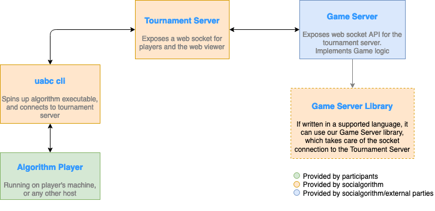

# Architecture

The Socialgorithm platform is made up of:

* Players: Code/AI written by competition participants to compete against others (e.g. a Battleships player)
* [Web UI](https://play.socialgorithm.org/): Interface that allows competition participants/admins to view/control player matching and game options. 
* [Games](./games.md): Servers that run games, processing moves/actions from Players, ensuring consistency and signalling game updates/end.
* [Tournament Server](https://github.com/socialgorithm/tournament-server/): Server that communicates with multiple Game Servers to start games or read results, and rank players in a tournament leaderboard.

All communication occurs over Websockets. 

Socialgorithm provides a number of libraries that abstract Websocket client/server setup and communication, so that competition players can focus on writing the best algorithms, and game writers can focus on writing fun games.

This architecture diagram shows how each piece integrates together:

# Games and Players

If you are interested in hosting a competition, you can either use one of our existing games, or integrate your own. See our [available games](https://socialgorithm.org/workshops/) or the documentation for how to [write your own game](./games.md).